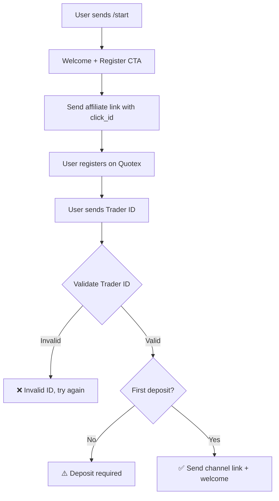

# Quotex Bot — Production System

> Telegram bot managing Quotex affiliate registration funnel — validates traders, tracks deposits, grants channel access.

---

## Flow



---

## Postback System

**`POST /`** — `https://quotex-bot-knk8.onrender.com/`

```
status={status}&{status}=true&eid={event_id}&cid={click_id}
     &sid={site_id}&lid={lid}&uid={trader_id}&country={country}
     &sumdep={sumdep}&sumwithdraw={sumwithdraw}
```

### Events

| Flag         | Trigger               |
|--------------|-----------------------|
| `reg`        | Registration          |
| `conf`       | Email confirmed       |
| `ftd`        | First deposit         |
| `dep`        | Subsequent deposit    |
| `withdrawal` | Withdrawal            |

### Postback Fields

| Field          | Description              |
|----------------|--------------------------|
| `eid`          | Event unique ID          |
| `cid`          | Click ID                 |
| `sid`          | Site ID                  |
| `lid`          | Link ID                  |
| `uid`          | Trader ID                |
| `country`      | Registration country     |
| `sumdep`       | Deposit amount           |
| `sumwithdraw`  | Withdrawal amount        |

### Affiliate Link

```
https://broker-qx.pro/sign-up/fast/?lid=2155288&click_id={cid}&site_id={sid}
```

---

## Architecture

```
src/
├── index.js                 # Entry point — starts bot + server
├── config.js                # Env-based configuration
├── database.js              # MongoDB connection
├── bot/
│   ├── index.js             # Telegraf bot setup + middleware
│   ├── keyboards.js         # Reply & inline keyboards
│   ├── middlewares/
│   │   └── admin.js         # Admin / superadmin guards
│   └── commands/
│       ├── user.js          # User flow: start, register, status
│       └── admin.js         # Admin panel, broadcast, config
├── server/
│   ├── app.js               # Express with helmet, cors, rate-limit
│   └── routes/
│       └── postback.js      # Postback webhook handler
├── models/
│   ├── User.js              # Telegram users
│   ├── Trader.js            # Quotex traders with event flags
│   └── Config.js            # Dynamic key-value config store
├── services/
│   ├── userService.js       # User CRUD + state management
│   ├── traderService.js     # Trader CRUD + event processing
│   ├── adminService.js      # Admin roles, config, maintenance
│   └── broadcastService.js  # Bulk messaging to active users
└── utils/
    ├── logger.js            # Winston console logger
    └── helpers.js           # URL builder, ID validator, UUID
```

---

## Stack

| Layer      | Tech                     |
|------------|--------------------------|
| Bot        | Telegraf 4               |
| Server     | Express 4 + Helmet + CORS |
| Database   | MongoDB + Mongoose 8     |
| Logging    | Winston 3                |
| Runtime    | Node 20+ (ESM)           |

---

## Roles

### 🛠️ Admin
- Broadcast messages & media
- Set min deposit, affiliate Link , channel link
- View stats

### 👤 User
- Register via affiliate link
- Submit Trader ID
- Check status
- Join private channel after deposit

---

## Setup

```bash
cp .env.example .env   # Fill in your values
npm install
npm start
```

## Scripts

| Command       | Description                |
|---------------|----------------------------|
| `npm start`   | Production start           |
| `npm run dev` | Dev mode with auto-restart |

---

## API

### `POST /postback` — Quotex affiliate webhook

Receives Quotex affiliate events and updates trader state. Rate limited: 30/min.

### `GET /lid` — Affiliate link redirect

Redirects to the Quotex sign-up page with the configured affiliate LID. Rate limited: 10/min.

### `GET /health` — Health check

Returns `{ status: "ok", timestamp: "..." }`.


